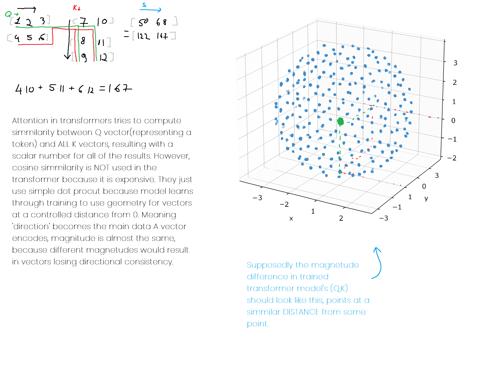
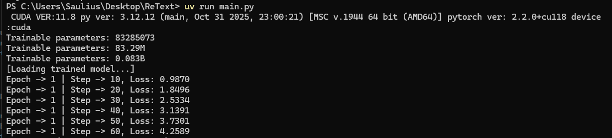
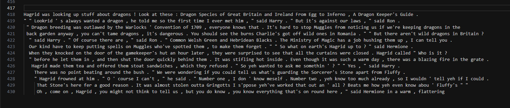

## Installation [1/2]

Requires Python 3.12+

```bash
uv sync
```
## Installation [2/2]
For `CUDA` support - overwrite torch libraries with specific versions for your GPU
```bash 
pip install torch==2.2.0+cu118 torchvision==0.17.0+cu118 torchaudio==2.2.0+cu118 -f https://download.pytorch.org/whl/cu118/torch_stable.html
```

```bash
uv pip install torch==2.2.0+cu118 torchvision==0.17.0+cu118 torchaudio==2.2.0+cu118 -f https://download.pytorch.org/whl/cu118/torch_stable.html
```

---
# Launch
```bash
uv run main.py
```

# Description

PyTorch-based transformer model implementation designed for text generation and language modeling tasks. It implements a from-scratch transformer architecture with multi-head self-attention and feed-forward blocks.







## Overview

ReText is a generative language model built on transformer architecture, trained on text datasets (particularly fine-tuned on Harry Potter text). The project includes multiple model variants and provides tools for training, evaluation, and text generation.

## Features

- **Transformer Architecture**: Full implementation of transformer blocks with multi-head self-attention and feed-forward layers
- **Tokenization**: Uses GPT-2 tokenizer (tiktoken) for encoding/decoding text
- **Flexible Configuration**: Customizable model hyperparameters including context length, embedding dimensions, attention heads, and dropout rates
- **Training Pipeline**: Complete training loop with gradient clipping, learning rate scheduling, and checkpoint saving
- **Text Generation**: Inference capabilities for generating text continuations from seed prompts
- **Model Variants**: Support for multiple model architectures including standard Transformer and Math models

## Project Structure
```
modules/
    ├── log/               # Model training output (text printed during TRAINING)
    ├── models/
    │   ├── Transformer/   # Main transformer model implementation
    │   └── Math/          # Alternative math-focused model variant 
    ├── ReText.py          # Main trainer with training logic
    ├── batcher.py         # Data batching utilities
    ├── model_config.py    # Configuration classes
    └── saved/             # Trained model checkpoints
datasets/              # Training datasets
```
Training
The model inside modules/saved is trained using AdamW optimizer with cross-entropy loss on next-token prediction tasks. Training details are logged and saved checkpoints allow for resumable training sessions.